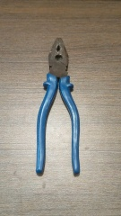
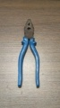
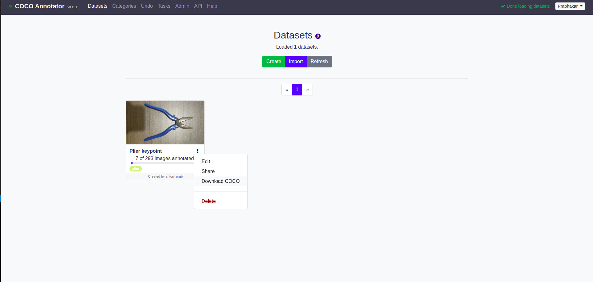

# Keypoint detection on custom dataset

## Introduction

Most of the keypoint detection model and repositories are trained on [COCO](https://cocodataset.org/#keypoints-2020) or [MPII](http://human-pose.mpi-inf.mpg.de/#overview) human pose dataset or facial keypoints. There were no tangible guide to train a keypoint detection model on custom dataset other than human pose or facial keypoints.  
And hence this repository will primarily focus on keypoint detection training on custom dataset using [Tensorflow object detection API](https://github.com/tensorflow/models/tree/master/research/object_detection). Here we have used a combination of [Centernet](https://arxiv.org/abs/1904.07850)-[hourglass](https://arxiv.org/abs/1603.06937) network therefore the model can provide both bounding boxes and keypoint data as an output during inference.  
We will be using the transfer learning technique on [centernet-hourglass104](http://download.tensorflow.org/models/object_detection/tf2/20200711/centernet_hg104_512x512_kpts_coco17_tpu-32.tar.gz) pre-trained model trained on coco dataset to speed-up the training process. 

## Table of contents

- [Preparing dataset](#preparing-dataset)
  - [Data collection](#data-collection)
  - [Annotation](#annotation)
  - [Processing dataset](#processing-dataset)
- [Model preparation](#model-preparation)
  - [Pretrained model](#pretrained-model)
  - [Parameter changes in config file](#parameter-changes-in-config-file)
  - [Creating label map](#creating-label-map)
- [Training](#training)
- [Inference](#inference)


## Preparing dataset

Create a folder structure similar to this order  
```
Custom-keypoint-detection
|_ dataset
    |_ images (folder to place all the images)
    |_ annotations (folder to place the annotation file)
    |_ tfrecord (folder to place tfrecord)
```
Our intention in this project is to detect cutting plier and it's 5 keypoints. Basically you can replace it with any object you need to detect.

### Data collection

Collect all your images and place it into your ```dataset/images``` folder. Make sure all the images are in same format, preferably .jpg/jpeg.





### Annotation

The TF2 object detection pipeline requires the dataset for centernet-hourglass network to be annotated on [coco data format](https://cocodataset.org/#format-data) as it's pretrained model is initially trained on COCO dataset.  
I have used [coco-annotator](https://github.com/jsbroks/coco-annotator), a web-based annotation tool that let's you annotate bounding boxes, keypoints, etc which also allows us to automatically download the annotations in coco data format. The [setup and installtion](https://github.com/jsbroks/coco-annotator/wiki/Getting-Started) using docker is super easy, where you can follow these steps to do so.

Run ```docker-compose up``` on terminal from the coco_annotator project directory. Once it's fired up, open ```http://localhost:5000``` on your web browser to go to COCO annotator web interface.

#### Create dataset

Go to *Datasets* tab and create a new dataset. Give a *dataset name* and click **Create Dataset**.  

  

It will automatically create a folder inside ```coco-annotator/datasets/(dataset_name)```. Now copy all the images from ```Custom-keypoint-detection/dataset/images``` to ```coco-annotator/datasets/(dataset_name)```. This will automatically import all the images into the coco-annotator tool.  

#### Create categories

Next step is to create the **_categories (labels)_** for our dataset to annotate. We create categories only for the objects that needs to be detected using bounding box. We won't create separate categories for keypoints, it will be a subset of the object itself.  
Link **_categories_** to the dataset by the **_Edit_** option.

  

#### Image annotation

Move to ```Datasets``` tab and click on the images to start annotating. Draw the bounding box first and press ```right arrow``` on the keyboard to annotate keypoints. Follow the same keypoints order while annotating which shows on the right side panel. 


After annotating the required images, download the annotation data through ```Datasets -> Download COCO```. All the annotation data will be saved and downloaded as a ```(dataset_name).json``` file.



### Processing dataset

## Model preparation

### Pretrained model

Download the [centernet-hourglass104 keypoints 512x512](http://download.tensorflow.org/models/object_detection/tf2/20200711/centernet_hg104_512x512_kpts_coco17_tpu-32.tar.gz) pre-trained model from [TF2 model zoo](https://github.com/tensorflow/models/blob/master/research/object_detection/g3doc/tf2_detection_zoo.md). You can also use [centernet-hourglass104 keypoints 1024x1024](http://download.tensorflow.org/models/object_detection/tf2/20200711/centernet_hg104_1024x1024_kpts_coco17_tpu-32.tar.gz) pretrained model.  
Extract and place the pre-trained model inside the ```/pretrained_models``` folder. Your folder structure should look like this 
```
Custom-keypoint-detection
|_ dataset
    |_ images (folder to place all the images)
    |_ annotations (folder to place the annotation file)
    |_ tfrecord (folder to place tfrecord)
|_ pretrained_model
    |_ centernet_hg104_512x512_kpts_coco17_tpu-32
```


### Parameter changes in config file

### Creating label map

## Training

## Inference

### To-do's
